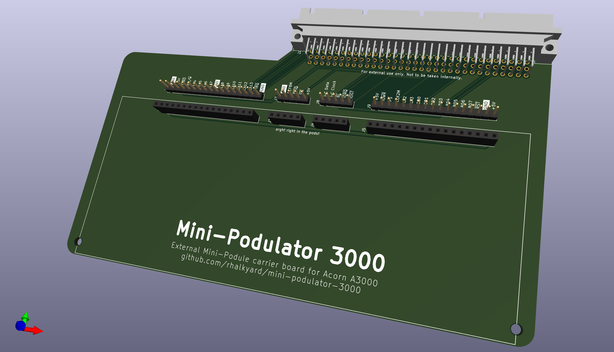

# Mini-Podulator 3000

External Mini-Podule carrier board for Acorn A3000 machines.

## Introduction

The Acorn A3000 is unique among Acorn's ARM systems in being able to accept both
an 8 bit "mini" expansion podules common to the A3010, A3020 and A4000 machines,
as well as a Eurocard-sized 16-bit podule as used by the rest of the Archimedes
and RiscPC range.

While the mini-podule fits internally, the standard podule slot on the A3000 is
merely exposed on the rear of the machine, able to accept a bare board but
clearly designed for an expansion enclosure of some kind. The mini-podule
interface is electrically identical to the standard podule interface, just with
an 8-bit data bus instead of 16 bit (and a couple of control lines omitted).
This carrier board is designed to act as a passive adapter allowing a second
mini-podule to be attached to the external podule connector.

## Why?

Because.

Though, more seriously, the main motivator for this is as an aid to developing
and testing hardware. My A3000 is my only Archimedes machine, and it does double
duty as both development environment and test rig. This carrier board will allow
me to experiment with a second mini-podule expansion card without sacrificing
the storage provided by my existing IDE mini-podule. Not to mention avoiding
having to leave the lid off!

## Compatibility

This carrier board is only really suitable for use with the A3000, as it is the
only machine with an external podule connector. It technically would fit in a
desktop system, but since it is shorter and wider (and with a minipodule
installed, taller) than a standard 100x160mm podule, it will not have mechanical
support and I do not recommend trying this.

## How to build

Order boards from your PCB fab house of choice. Solder components to board. It
shouldn't be too hard to figure out.

J1 is a 96-position DIN 41612 Eurocard connector, right-angle, board mount, with
male pins. Only rows A and C (i.e. 64 of the 96 pins) are used, but a 3-row
connector will also fit. Something like [Amphenol
86094647113745ELF](https://www.digikey.com/en/products/detail/amphenol-cs-fci/86094647113745ELF/5203923)
should do the job.

J2-J5 are generic 0.1"-pitch pin sockets. J2 and J5 are 1x17 pin, J3 and J4 are
1x5 pin.

J6-J9 are optional 0.1" pin headers to allow connection of logic analyser probes
for debugging. Leave them out if you want.

## To-do

Mini-podules need to be supported at the back panel. The mounting holes on the
rear edge of the carrier board are intended for some kind of bracket that
provides mechanical support to both the podule and the carrier board. Not sure
exactly what form this will take, but some kind of 3D-printed contraption would
work well here. Watch this space.

## (Lack of) warranty

I hope it goes without saying, but building something like this does come with
risks - you are exposing the sensitive internals of the computer to the
cruelties of the outside world.

If you take sensible ESD precautions and avoid shorting anything out, it should
be fine, but if you do manage blow up your machine with this, don't say I didn't
warn you.
